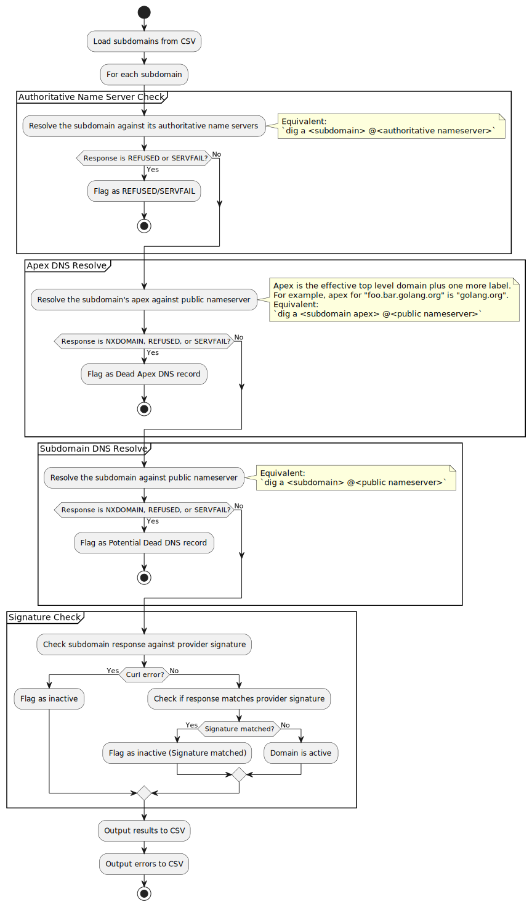

# tko-subs

> This part is the README with updated instructions of this fork.

## Updated Usage Instructions

### Flow Overview

<details>
  <summary>Plantuml of the flow</summary>

```
@startuml
start

:Load subdomains from CSV;

:For each subdomain;

partition "Authoritative Name Server Check" {
  :Resolve the subdomain against its authoritative name servers;
  note right
  Equivalent:
  `dig a <subdomain> @<authoritative nameserver>`
  end note

  if (Response is REFUSED or SERVFAIL?) then (Yes)
    :Flag as REFUSED/SERVFAIL;
    stop
  else (No)
  endif
}

partition "Apex DNS Resolve" {
  :Resolve the subdomain's apex against public nameserver;
  note right
  Apex is the effective top level domain plus one more label.
  For example, apex for "foo.bar.golang.org" is "golang.org".
  Equivalent:
  `dig a <subdomain apex> @<public nameserver>`
  end note
  if (Response is NXDOMAIN, REFUSED, or SERVFAIL?) then (Yes)
    :Flag as Dead Apex DNS record;
    stop
  else (No)
  endif
}

partition "Subdomain DNS Resolve" {
  :Resolve the subdomain against public nameserver;
  note right
  Equivalent:
  `dig a <subdomain> @<public nameserver>`
  end note
  if (Response is NXDOMAIN, REFUSED, or SERVFAIL?) then (Yes)
    :Flag as Potential Dead DNS record;
    stop
  else (No)
  endif
}

partition "Signature Check" {
  :Check subdomain response against provider signature;
  if (Curl error?) then (Yes)
    :Flag as inactive;
  else (No)
    :Check if response matches provider signature;
    if (Signature matched?) then (Yes)
      :Flag as inactive (Signature matched);
    else (No)
      :Domain is active;
    endif
  endif
}

:Output results to CSV;
:Output errors to CSV;

stop
```

</details>

[](https://editor.plantuml.com/uml/lLJBQjj05DthAoxUr0QZxksGnlW1WTGf5WtjBcFfIXewcglEmmHA_xrN8qj-fS7feZ2BUTrppZrdc3lhX76-Kb6OHD7aWKG6rcypgeJK5d935SoJfocVhSW0YhGydFDkpNNIIT8mc7bNaf5EEBb3M8iA8K6pGmFp4jCV0_WL0KmsQ4dnkIln00IYQEWSI6T1dE3e1iS673jb04qEmSYYTBnO_lHo9nHgDm5UFcUo004tFUujtDrSmhLejyzSWJeBY3pb8NCOihwQj4MG5ZRBrTTakG1kF5bkdbQp-uTFeqQvXk5tj2CkuOvMIZ1hV_jZTtKQZgsZkY5I33bSqwWbbNdq-zIy6bzWiKvWxyzRRdrWZvhhdMcrtogP7hLsuLD0vuOQ6CnpJ8CNh0mKxb31FeLQUGka4Ieo24fiKSLS7O9_4LMjSDmovxmpo8dYhJ1nGKhe8YPJ31gEmT4wlYAZWDW4TT76UKBdyQo_BHu_p-xNuyxwyPL9BP1VUU-umPHCzgwqabxybP6z8wjhtlJ_i-eBusadXMfD-rU_PA65y_oeZh-2C3_oo7I2UxCCxMJ67uZjwgVxtkRUA41ZoBoXNMeH7lhqJ65FpKWzPoLSMgBz2sVBUcYZlPrTahz2_qhTgCKy5SMbYzO83koWl7FqoDd9etUrTuruh_Z7TDJ-qTr-CEQm7JKf_G40)

### Installation

You can download the binary directly from the [releases page](https://github.com/howhow06/tko-subs/releases) rather than building from source.

### Required Files

Before running the tool, ensure you have these two files in the same directory as the binary:

1. `domains.csv` - Contains the domains to check (follow the format shown below)
2. `providers-data.csv` - Contains provider information for vulnerability checking

If either file is missing, the tool will not function properly. Example files are included in the repository.

### New Usage with CSV Format

This fork has been modified to accept a CSV file instead of a simple domains.txt file:

```
./tko-subs --domains domains.csv
```

#### CSV Format

The input CSV file should follow this structure (refer to the example file included in the repository):

```
domain,content
jerry.com,ns-1577.awsdns-05.co.uk.
borry.com,
```

### Error Handling

Domains that encounter errors during processing will automatically be written to `unprocessed_domains.csv`. This helps you identify which domains need further investigation.

### Important Warning

⚠️ The `-takeover` flag, which automatically attempts to perform subdomain takeovers, has not been thoroughly tested in this fork. It is strongly recommended **NOT** to use this option in production environments.

If you want to perform actual takeovers, please manually verify the findings first and proceed with caution.

---

> Below is the README content from Original Author.

This tool allows:

- To check whether a subdomain can be taken over because it has:

  - a dangling CNAME pointing to a CMS provider (Heroku, Github, Shopify, Amazon S3, Amazon CloudFront, etc.) that can be taken over.
  - a dangling CNAME pointing to a non-existent domain name
  - one or more wrong/typoed NS records pointing to a nameserver that can be taken over by an attacker to gain control of the subdomain's DNS records

- To actually take over those subdomain by providing a flag `-takeover`. Currently, take over is only supported for Github Pages and Heroku Apps and by default the take over functionality is off.

- To specify your own CMS providers and check for them via the [providers-data.csv](providers-data.csv) file. In that file, you would mention the CMS name, their CNAME value, their string that you want to look for and whether it only works over HTTP or not. Check it out for some examples.

### Disclaimer: DONT BE A JERK!

Needless to mention, please use this tool very very carefully. The authors won't be responsible for any consequences.
By default, this tool does not allow taking over of subdomains. If you want to do it, just specify the `-takeover` flag.

### Pre-requisites

We need GO installed. Once you have GO, just type `go get github.com/anshumanbh/tko-subs` to download the tool.

Once the tool is downloaded, type `tko-subs -h`.

The next thing we need to do is to get the following information:

- Github's Personal Access Token - Make sure this token has the rights to create repositories, references, contents, etc. You can create this token here - https://github.com/settings/tokens
- Heroku Username and API key
- Heroku app name - You can create a static app on Heroku with whatever you want to be displayed on its homepage by following the instructions here - https://gist.github.com/wh1tney/2ad13aa5fbdd83f6a489. Once you create that app, use that app name in the flag (see below). We will use that app to takeover the domain (with the dangling CNAME to another Heroku app).

NOTE - You only need these values if you want to take over subdomains. By default, that's not required.

Required Go Packages to build.

```
go get github.com/bgentry/heroku-go
go get github.com/gocarina/gocsv
go get github.com/google/go-github/github
go get github.com/olekukonko/tablewriter
go get golang.org/x/net/publicsuffix
go get golang.org/x/oauth2
go get github.com/miekg/dns
```

### How to run?

Once you have everything installed, `cd` into the directory and type:
`tko-subs -domains=domains.txt -data=providers-data.csv -output=output.csv`

If you want to take over as well, the command would be:
`tko-subs -domains=domains.txt -data=providers-data.csv -output=output.csv -takeover -githubtoken=<github-token> -herokuusername=<heroku-username> -herokuapikey=<heroku-api-key> -herokuappname=<heroku-app-name>`

If you just want to check for a single domain, type:
`tko-subs -domain <domain-name>`

If you just want to check for multiple domains, type:
`tko-subs -domain <domain-name-1>,<domain-name-2>`

By default:

- the `domains` flag is set to `domains.txt`
- the `data` flag is set to `providers-data.csv`
- the `output` flag is set to `output.csv`
- the `takeover` flag is not set so no take over by default
- the `domain` flag is NOT set so it will always check for all the domains mentioned in the `domains.txt` file. If the `domain` flag is mentioned, it will only check that domain and ignore the `domains.txt` file, even if present
- the `threads` flag is set to `5`

So, simply running `tko-subs` would run with the default values mentioned above.

### How is providers-data.csv formatted?

name,cname,string,http

- name: The name of the provider (e.g. github)
- cname: The CNAME used to map a website to the provider's content (e.g. github.io)
- string: The error message returned for an unclaimed subdomain (e.g. "There isn't a GitHub Pages site here")
- http: Whether to use http (not https, which is the default) to connect to the site (true/false)

### How is the output formatted?

Domain,CNAME,Provider,IsVulnerable,IsTakenOver,Response

- Domain: The domain checked
- CNAME: The CNAME of the domain
- Provider: The provider the domain was found to be using
- IsVulnerable: Whether the domain was found to be vulnerable or not (true/false)
- IsTakenOver: Whether the domain was taken over or not (true/false)
- Response: The message that the subdomain was checked against

If a dead DNS record is found, `Provider` is left empty.
If a misbehaving nameserver is found, `Provider` and `CNAME` are left empty

### What is going on under the hood?

This will iterate over all the domains (concurrently using GoRoutines) in the `subdomains.txt` file and:

- See if they have a misbehaving authoritative nameserver; if they do, we mark that domain as vulnerable.
- See if they have dangling CNAME records aka dead DNS records; if they do we mark that domain as vulnerable.
- If a subdomain passes these two tests, it tries to curl them and get back a response and then try to see if that response matches any of the data provider strings mentioned in the [providers-data.csv](providers-data.csv) file.
- If the response matches, we mark that domain as vulnerable.
- Next, depending upon whether the `takeover` flag is mentioned or not, it will try to take over that vulnerable subdomain.
- For example, to takeover a Github Page, the code will:
  - Create a repo
  - Create a branch `gh-pages` in that repo
  - Upload `CNAME` and `index.html` to the `gh-pages` branch in that repo. Here, `CNAME` contains the domain that needs to be taken over. `index.html` contains the text `This domain is temporarily suspended` that is to be displayed once the domain is taken over.
- Similarly, for Heroku apps, the code will:
  - Add the dangling domain to your Heroku app (whose name you will be providing in the .env file)
- And, that's it!

### Future Work

- ~Take CMS name and regex from user or .env file and then automatically hook them into the tool to be able to find it.~ DONE
- Add takeovers for more CMS
- Add more CMS providers

### Credits

- Thanks to Luke Young (@TheBoredEng) for helping me out with the go-github library.
- Thanks to Frans Rosen (@fransrosen) for helping me understand the technical details that are required for some of the takeovers.
- Thanks to Mohammed Diaa (@mhmdiaa) for taking time to implement the provider data functionality and getting the code going.
- Thanks to high-stakes for a much needed code refresh.

### Changelog

`5/27`

- Added new Dockerfile reducing the size of the image
- Added sample domains.txt file to test against
- mhmdiaa added the logic for dead DNS takeovers. Updated documentation. Thanks a lot!

`11/6`

- high-stakes issues a PR with a bunch of new code that fixes a few bugs and makes the code cleaner

`9/22`

- Added an optional flag to check for single domain
- Made it easier to install and run

`6/25`

- Made the code much more faster by implementing goroutines
- Instead of checking using Golang's net packages' LookupCNAME function, made it to just use dig since that gives you dead DNS records as well. More attack surface!!
